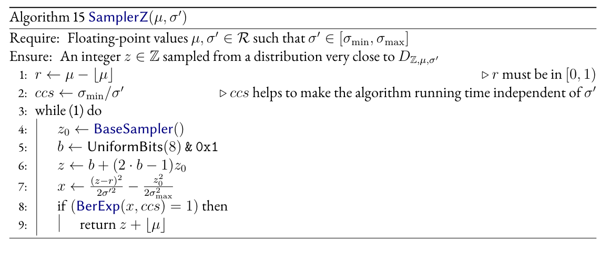
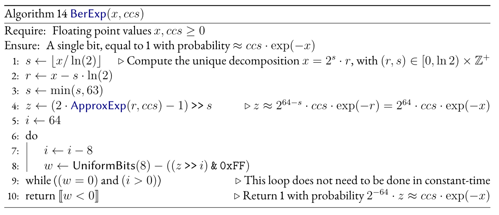
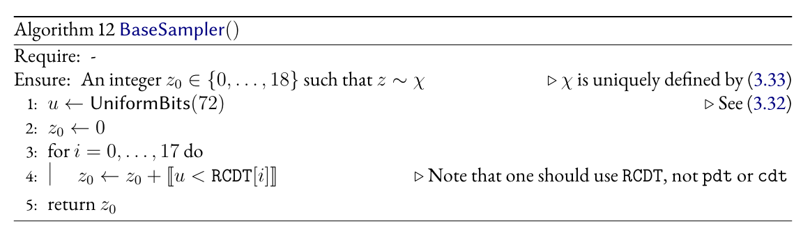
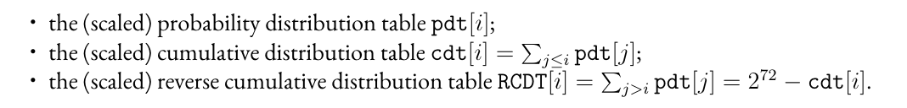
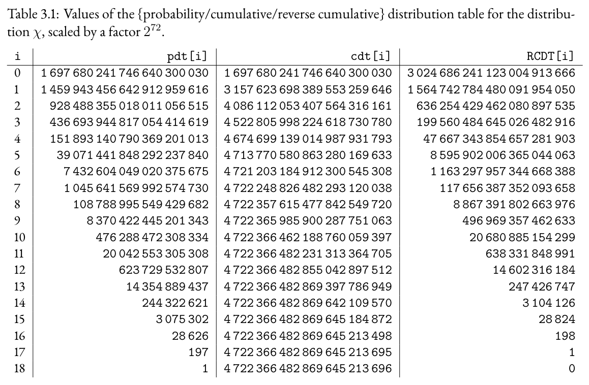
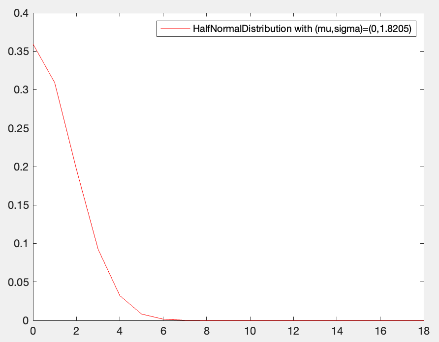

代码运行命令：

```
gcc -o main.o main.c fpr.c rng.c sampler.c shake.c
./main.o
```


w0:00BF6EBB: 12545723
v0:00BBF29F: 12317343
cc:00000001
v0-w0:FFFC83E4 = v0+$2^{32}-1$-w0

unsigned 数值相减（小减大：a-b），实际上应该是a+(~b), ~b为b的补码，对于32位的unsigned数值 ~b = $2^{32}-1 -b$


### Sampler函数

文件夹`example/sampler`中的高斯采样算法由文件sampler.c中的函数`int sampler(void *ctx, fpr mu, fpr isigma)`实现





输入参数：

`ctx`: 存储prng和sigma_min的数据结构
`mu`: 离散高斯分布的中心
`isigma`: 1/sigma, 其中sigma是离散高斯分布里的离均差。The value of sigma MUST lie between 1 and 2 (i.e. isigma lies between 0.5 and 1); in Falcon, sigma should always be between 1.2 and 1.9.

s = $\lfloor$ mu $\rfloor$
r = mu-s. 
dss = 1/(2*sigma$^2$) = 0.5*(isigma$^2$).
ccs = sigma_min / sigma = sigma_min * isigma.

fpr_inv_2sqrsigma0 = { .150865048875372721532312163019 }; //$\frac{1}{2\sigma_0^2}$

反推可得：$\sigma_0$ = 1.8205

在中心r上进行采样：

一、先在一个中心为b（b=0或1, 因为 0<r<1, 所以采用双峰采样）的高斯分布上采样z。
1. `z0 = gaussian0_sampler(&spc->p);` 使用中心为0的高斯采样器输入随机数生成器p，得到采样值z0
2. `b = (int)prng_get_u8(&spc->p) & 1;` 在双峰分布上使用随机数生成器p采样一个8bit的随机数，并计算它和1的按位与结果。得到b=0或1.
3. 若b=1，则令z=z0+1;若b=0时，则z=-z.


然后在中心r上进行拒绝采样。（因为这个时候在0-1双峰分布上进行的高斯采样已经非常接近r的分布了）

目前已实现的分布（上面的算法）：G(z) = $e^{-((z-b)^2)/(2*sigma0^2)}$

我们期望实现的目标分布: $S(z) = e^{-((z-r)^2)/(2*sigma^2)}$

此时拒绝采样可以保证采样到符合目标分布的$z$， 保留$z$的概率为$S(z)/G(z)$。 

实现步骤：

1. $x = \frac{\sqrt{z-r}}{2\sigma^2} - \frac{z_0^2}{2\sigma_0^2}$

BerExp:*Sample a bit with probability exp(-x) for some x >= 0.* 若返回1，则保留z；返回0，则重新采样z。


### gaussian0_sampler函数

$\sigma_0 = 1.8205$, 精度：72bit. 查表法。存储表单dist. 一个72比特的数，在表中由第[3i：3(i+1)]个元素组成。（从左到右，依次从高位到低位）


**prng_get_u64**: 使用PRNG生成64比特随机数

**prng_get_u8**: 使用PRNG生成8比特随机数

1. 生成随机72比特数，分三次生成24比特数: v0, v1, v2。
2. 采样z，使得v0,...,v2比表中前z个元素小。





### dist(0,1.8205,72bit): 半高斯分布表

```
static const uint32_t dist[] = {
        10745844u,  3068844u,  3741698u,
        5559083u,  1580863u,  8248194u,
        2260429u, 13669192u,  2736639u,
        708981u,  4421575u, 10046180u,
        169348u,  7122675u,  4136815u,
        30538u, 13063405u,  7650655u,
        4132u, 14505003u,  7826148u,
        417u, 16768101u, 11363290u,
        31u,  8444042u,  8086568u,
        1u, 12844466u,   265321u,
        0u,  1232676u, 13644283u,
        0u,    38047u,  9111839u,
        0u,      870u,  6138264u,
        0u,       14u, 12545723u,
        0u,        0u,  3104126u,
        0u,        0u,    28824u,
        0u,        0u,      198u,
        0u,        0u,        1u
};
```

表`dist`是中心为0，标准差为1.8205的半高斯分布的概率表，其精度为72bit。

表中存储的值为Table 3.1在 24bit|24bit|24bit下的表示。

即对于任意一组dist[3i:3i+3], 
$$
dist[3i]*(2^{24})^2 + dist[3i+1]*2^{24} + dist[3i+2] = RCDT[i]
$$







数据生成方式：

```matlab
%生成中心为0，离均差为1.8205的离散半高斯分布
x = 0:1:18;
pd2 = makedist('HalfNormal','mu',0,'sigma',1.8205);
y0 = pdf(pd2,x);  
y0 = y0/sum(y0);
plot(x,y0,'r');
legend('sigma=1.8205');
```

y0: [ 0.359497774665512	0.309155052226219	0.196615056960551	0.0924735397816241	0.0321646236778447	0.00827369963555850	0.00157391512835399	0.000221423215200606	2.30369658822671e-05	1.77250589838061e-06	1.00858007110644e-07	4.24417574917429e-09	1.32079866115959e-10	3.03976607689712e-12	5.17373275250824e-14	6.51220558919132e-16	6.06195205728394e-18	4.17308446807751e-20	2.12452642417120e-22]



