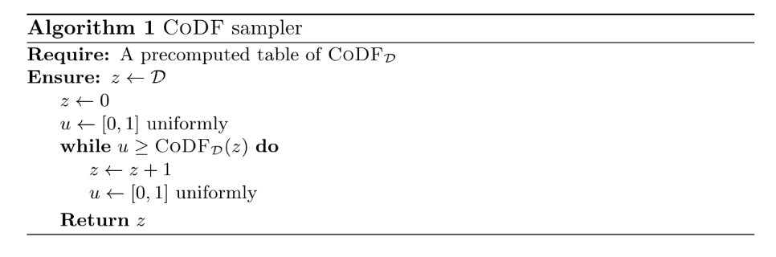
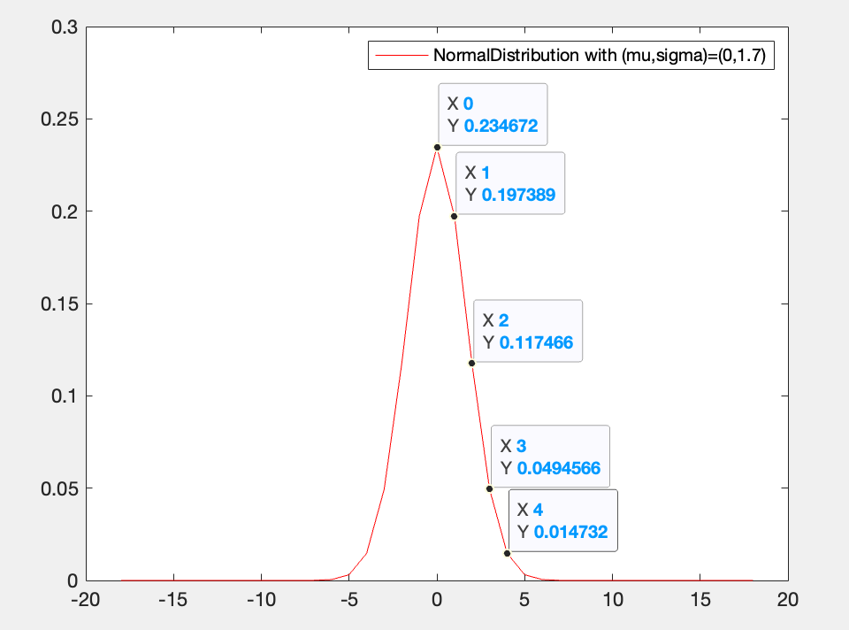

# [Pre17]代码实现过程记录

代码运行命令：

```
clang -o main.o main.c fpr.c rng.c sampler.c shake.c
./main.o
```


[Pre17]: Gaussian sampling over the integers: Efficient, generic, constant-time.

生成代码文件：

## 根据[Pre17]给出的条件累计分布函数生成RCDT表，替换代码中的dist表

原累计分布函数：

**定义 3（累计分布函数）** 给定集合$S\subseteq \mathbb{Z} $上的概率分布$\mathcal{D}$， 定义$S$上的累计分布函数${\rm CDF}_\mathcal{D}$为：
$$
{\rm CDF}_\mathcal{D}(z) =  \sum_{i\leq z} \mathcal{D}(z)
$$
(如果是离散高斯分布，则$\mathcal{D}(z) = D_{\mathbb{Z},\sigma,c}(z)$)

Falcon中给出的密度函数值$\chi(z) =\mathcal{D}(z) \cdot 2^{72}$. 

[Pre17]中累计分布函数：

**定义4（条件密度函数）** ${\rm CoDF}(z) = \mathcal{D}(z)/ (\sum_{i\geq z} \mathcal{D}(i)) $

cocdt的72比特表示：

scale_cocdt: ['1697680241746640300030', '2279372965301550815585', '2802161691340659406131', '3241201558344652188433', '3594374298710224785633', '3870777192544123365132', '4083280639489000033650', '4244744583321828878113', '4366456576218680464462', '4457703379115760614478', '4525849902074055087860', '4576606912806142116239', '4614338834509961334126', '4642349055341364023571', '4663121390094755277005', '4678515978250233935404', '4689927245997310015517', '4698516147097576298475', '4722366482869645213696']


rcocdt: 1- cocdt (这样存可以减少存储空间)

new_prec: 10 bit

scale_rcocdt: ['656', '530', '416', '321', '245', '185', '139', '104', '77', '57', '43', '32', '23', '17', '13', '10', '7', '5', '0']

for 0 to 18.




while(u$\geq$CoDF$_\mathcal{D}$(z))   --> while(u$<$rCoDF$_\mathcal{D}$(z))


Example: 生成mu=0， sigma = 1.7的离散高斯分布


